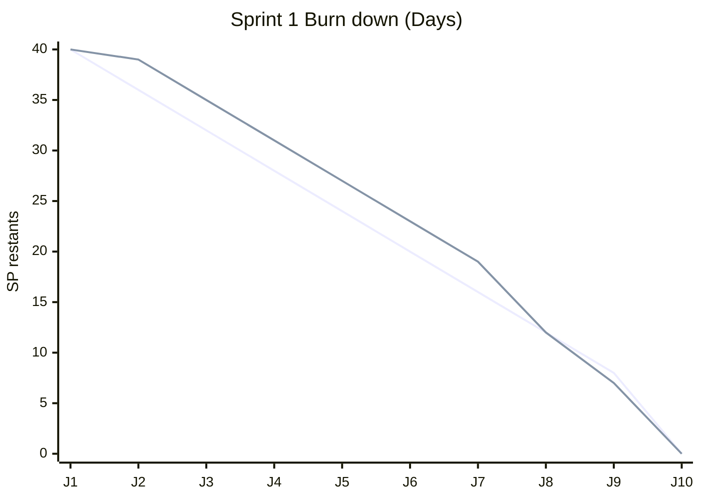

# Burn down chart - Echelle Days

## Donnees Sprint 1
- Charge initiale: **40 Story Points**
- Duree: **10 jours**
- Echelle: **Days**

## Tableau de suivi

| Jour | Ideal (SP restant) | Reel (SP restant) |
|---|---:|---:|
| J1 | 40 | 40 |
| J2 | 36 | 39 |
| J3 | 32 | 35 |
| J4 | 28 | 31 |
| J5 | 24 | 27 |
| J6 | 20 | 23 |
| J7 | 16 | 19 |
| J8 | 12 | 12 |
| J9 | 8 | 7 |
| J10 | 0 | 0 |

## Version graphique (Mermaid)

## Lecture rapide
- Ecart au debut (J2 a J7), rattrapage a J8.
- Fin de sprint dans la cible (0 SP restant a J10).
