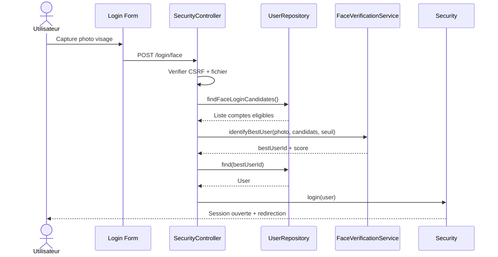

# Validation Sprint 1 - Travail User uniquement

## 1) Sprint Backlog (User)

| ID | User Story | Type | Estimation (SP) | Statut |
|---|---|---|---:|---|
| U-01 | En tant que visiteur, je peux creer un compte. | CRUD (Create) | 3 | Termine |
| U-02 | En tant qu utilisateur, je peux me connecter/deconnecter en securite. | CRUD (Read session) | 3 | Termine |
| U-03 | En tant qu utilisateur, je peux modifier mon profil (nom, tel, email, avatar). | CRUD (Update) | 5 | Termine |
| U-04 | En tant qu utilisateur, je peux desactiver mon compte. | CRUD (Update status) | 3 | Termine |
| U-05 | En tant qu admin, je peux lister/rechercher/filtrer les utilisateurs. | CRUD (Read) | 3 | Termine |
| U-06 | En tant qu admin, je peux suspendre/reactiver un utilisateur. | CRUD (Update status) | 5 | Termine |
| U-07 | En tant qu utilisateur, je peux demander la reactivation du compte. | Avance (API interne + workflow) | 3 | Termine |
| U-08 | En tant qu utilisateur, je peux me connecter par reconnaissance faciale. | Avance (API IA) | 8 | Termine |

Total User scope: **33 SP**

## 2) User story orale (1 CRUD + 1 avancee API)

### CRUD choisi: U-03 Mise a jour du profil
- Route: `POST /profile/update`
- Contenu: email, nom, prenom, telephone, avatar, selfie, piece identite
- Regles: CSRF, validation email unique, controle format image, taille max
- Resultat: profil persiste en base avec messages de retour utilisateur

### Avancee API choisie: U-08 Connexion faciale
- Route: `POST /login/face`
- Pipeline:
  - upload image temporaire
  - chargement des comptes eligibles
  - comparaison visage via `FaceVerificationService`
  - selection meilleur candidat + seuil
  - login si compte autorise
- Resultat: authentification rapide sans mot de passe

## 3) Diagramme de sequence objets (User - connexion faciale)

## 4) Burn down chart (Days) - Scope User

| Jour | Ideal SP restant | Reel SP restant |
|---|---:|---:|
| J1 | 33 | 33 |
| J2 | 30 | 31 |
| J3 | 26 | 28 |
| J4 | 23 | 24 |
| J5 | 20 | 21 |
| J6 | 16 | 17 |
| J7 | 13 | 12 |
| J8 | 10 | 8 |
| J9 | 6 | 4 |
| J10 | 0 | 0 |

## 5) Tableau blanc Trello (1 semaine, user)

- Lundi: inscription + login classique
- Mardi: update profil + upload avatar
- Mercredi: verification selfie + piece identite
- Jeudi: liste users admin + filtres + export
- Vendredi: suspension/reactivation + demande reactivation + recette

## 6) References code (User)
- `src/Controller/Front/RegistrationController.php`
- `src/Controller/Front/SecurityController.php`
- `src/Controller/Front/ProfileController.php`
- `src/Controller/Back/AdminController.php`
